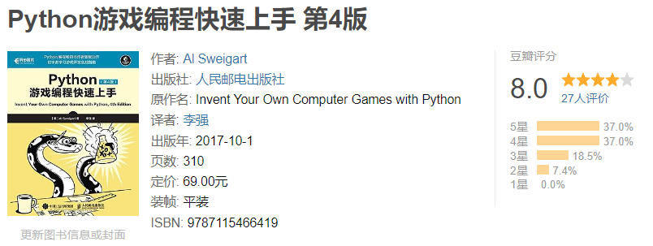

# invent-your-own-computer-games-with-python
python游戏编程快速上手

# 代码实现

- [chapter 01](https://github.com/YeJiu97/invent-your-own-computer-games-with-python/tree/main/src/chapter_001)
- [chapter 02](https://github.com/YeJiu97/invent-your-own-computer-games-with-python/tree/main/src/chapter_002)
- [chapter 03](https://github.com/YeJiu97/invent-your-own-computer-games-with-python/tree/main/src/chapter_003)
- [chapter 04](https://github.com/YeJiu97/invent-your-own-computer-games-with-python/tree/main/src/chapter_004)
- [chapter 05](https://github.com/YeJiu97/invent-your-own-computer-games-with-python/tree/main/src/chapter_005)
- [chapter 06](https://github.com/YeJiu97/invent-your-own-computer-games-with-python/tree/main/src/chapter_006)
- [chapter 07](https://github.com/YeJiu97/invent-your-own-computer-games-with-python/tree/main/src/chapter_007)
- [chapter 08](https://github.com/YeJiu97/invent-your-own-computer-games-with-python/tree/main/src/chapter_008)
- [chapter 09](https://github.com/YeJiu97/invent-your-own-computer-games-with-python/tree/main/src/chapter_009)
- [chapter 10](https://github.com/YeJiu97/invent-your-own-computer-games-with-python/tree/main/src/chapter_010)
- [chapter 11](https://github.com/YeJiu97/invent-your-own-computer-games-with-python/tree/main/src/chapter_011)
- [chapter 12](https://github.com/YeJiu97/invent-your-own-computer-games-with-python/tree/main/src/chapter_012)
- [chapter 13](https://github.com/YeJiu97/invent-your-own-computer-games-with-python/tree/main/src/chapter_013)
- [chapter 14](https://github.com/YeJiu97/invent-your-own-computer-games-with-python/tree/main/src/chapter_014)
- [chapter 15](https://github.com/YeJiu97/invent-your-own-computer-games-with-python/tree/main/src/chapter_015)
- [chapter 16](https://github.com/YeJiu97/invent-your-own-computer-games-with-python/tree/main/src/chapter_016)
- [chapter 17](https://github.com/YeJiu97/invent-your-own-computer-games-with-python/tree/main/src/chapter_017)
- [chapter 18](https://github.com/YeJiu97/invent-your-own-computer-games-with-python/tree/main/src/chapter_018)
- [chapter 19](https://github.com/YeJiu97/invent-your-own-computer-games-with-python/tree/main/src/chapter_019)
- [chapter 20](https://github.com/YeJiu97/invent-your-own-computer-games-with-python/tree/main/src/chapter_020)

# 书籍评价

这本书教的内容是关于使用python来实现一些简单的非GUI（除了后面的Pygame）的游戏，有一些游戏中文社区其实不熟悉，比如说hang_man这种猜单词的游戏，另外这本书的结构应该存在着一些问题，先给出整个代码，然后再讲解一段一段代码，这样的结构不是非常好，应该在讲解了游戏和给出流程之后，一段一段开发，然后最后给出整个代码，让人直接看整个代码再讲解，从流程上来讲不是非常的循序递进。另外代码似乎不是非常的Pythonic，感觉可以重构一下。另外这本书里面的代码似乎缺乏了关于OOP的内容，可能另外一本专门关于OOP的的Python游戏开发的书籍能够弥补这个空缺。
